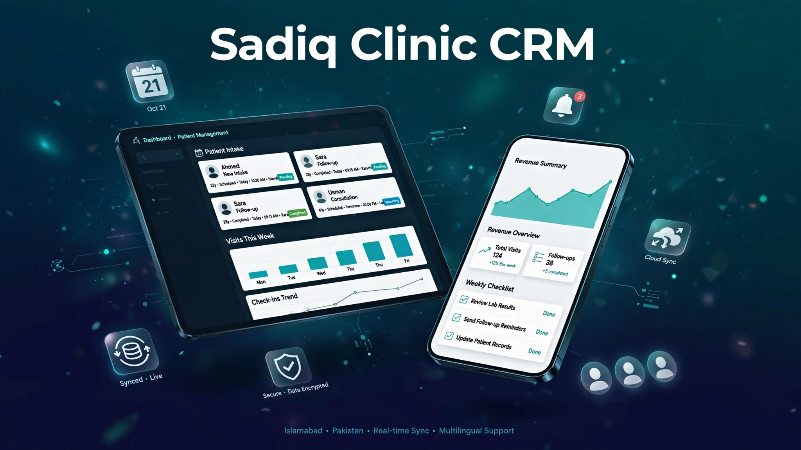

<div align="center">

# 📋 Sadiq Clinic CRM


An offline-first patient CRM for **Sadiq Medical & Gynae Clinic**, built for the reception desk. It registers patients, logs visits and fees, flags cases for doctor review, and produces daily collection reports — and it keeps working when the internet drops.

</div>

## ✨ Features

- **Reception intake** — quick patient registration (name, age, gender, phone) with service selection: Checkup, Drip, Injection, Gynae Consult, General Clinic — plus fee and Cash/Online payment method
- **Patient directory** — searchable patient list with a detail page showing each patient's full visit history and fee totals
- **Review queue** — visits can be flagged for review, and flagged cases get a dedicated review page
- **Reports page** — daily summaries: patient counts, flagged cases, per-service breakdowns, and revenue (cash vs. online)
- **WhatsApp daily report** — one-tap generation of a formatted daily collection & patient report in Rs., ready to share
- **PIN lock screen + role login** — role-based access for receptionist and doctor (JWT-based auth)
- **Offline-first** — all records are stored locally with Dexie (IndexedDB), so the reception desk never stops during internet outages
- **Background cloud sync** — unsynced records push to the cloud Postgres database automatically when connectivity returns
- **Installable PWA** — app manifest + service worker so it installs like a native app on clinic devices

## 🛠 Tech Stack

| Tech | Role |
|------|------|
| Next.js 16 (App Router) | Framework |
| React 19 | UI |
| TypeScript | Type safety |
| Tailwind CSS 4 | Styling |
| Dexie.js (IndexedDB) | Offline-first local storage |
| Drizzle ORM + Neon serverless | Cloud Postgres persistence |
| @ducanh2912/next-pwa | PWA / service worker |
| jose | JWT authentication |
| Lucide React | Icons |

## 🚀 Getting Started

```bash
npm install
npm run dev
```

Open [http://localhost:3000](http://localhost:3000) in your browser.

To enable cloud sync and auth, add your Neon Postgres connection string to `.env.local`:

```bash
DATABASE_URL="postgresql://..."
```

Then:

```bash
npm run db:push   # push schema to the database (drizzle-kit)
npm run db:seed   # seed demo receptionist & doctor accounts
```

> Note: without `DATABASE_URL`, the app still runs fully offline — local intake, visits, and reports keep working via Dexie. The cloud sync kicks in once a database is connected.

Other scripts:

```bash
npm run build      # production build
npm run start      # serve the production build
npm run lint       # run ESLint
npm run db:studio  # open Drizzle Studio to inspect the database
```

## 👀 Preview



---

Built with care by **[Hussnain Ahmad](https://github.com/hussnainahmedd)** — BSCS student learning by shipping real tools for real people.
